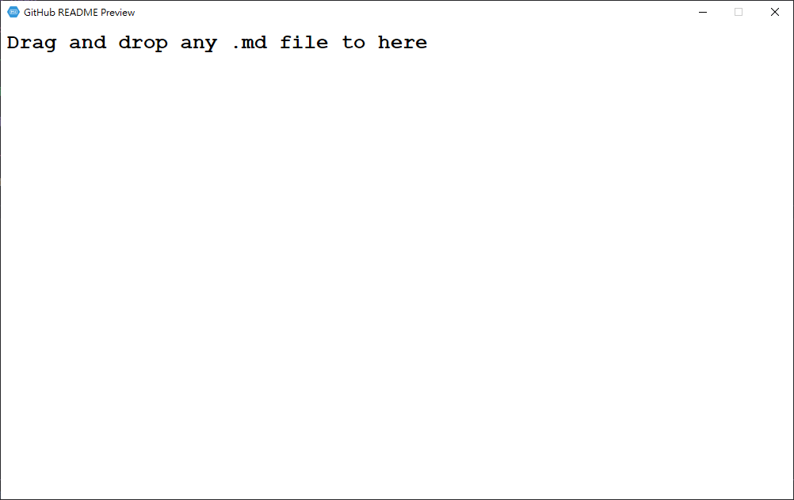
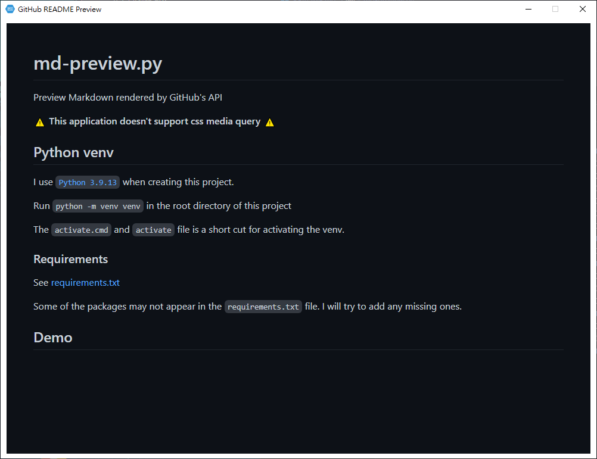

# md-preview.py
Preview Markdown rendered using GitHub's API

**⚠️ This application doesn't support css with media query ⚠️**

This is my first PyQt project so the code might be a bit messy.

There might be bugs in this project, it needs further debugging

## How to use
I suggest to use a venv but it's up to you

1) You create a Python venv first & activate it (Optional)
2) Install required packages listed in [requirements.txt](./requirements.txt)
3) Run the `main.py`
4) Drag and drop any markdown file on to the application

When you save the changes on the opened markdown file, you will see "Reloading..." from the title.
The application is reading the markdown content & sending request to GitHub's API for rendering. This won't take long.

I set the maximum width to be 1000 (Should be pixels), see [here](https://github.com/sindresorhus/github-markdown-css#usage) for reason

When you click on any URL or links on the markdown file it will be opened in browser. (Or maybe text editor for text files)

## Python venv
I use [`Python 3.9.13`](https://www.python.org/downloads/release/python-3913/) when developing this project.

Run `python -m venv venv` in the root directory of this project (Or `python3` if you're on Linux)

The `activate.cmd` and `activate` files are the shortcut for activating the venv.

### Requirements
See [requirements.txt](./requirements.txt)

Some of the packages may not appear in the `requirements.txt` file. I will try to add any missing ones.

## Demo
### After launching

### Loaded a markdown file
